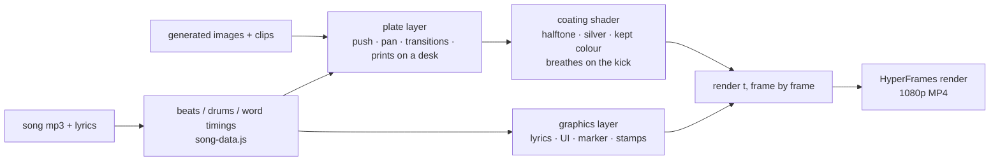

<p align="center"></p>

<h1 align="center">code-native-mv-kit</h1>

<p align="center">
  <b>Music videos cut in code.</b> One song, three films, two Claude skills. The AI directs and edits, and every frame lands on a beat and a word.<br>
  <a href="README.md">中文</a> ·
  <a href="https://github.com/yangyue1974/code-native-mv-kit/releases">Watch the films</a> ·
  <a href="#quick-start">Quick start</a>
</p>

<p align="center">
  
  
  
  
</p>

---

Most AI video looks the same: plastic faces, slow push-ins, and edits that ignore the music. This kit takes the other road. **The picture is rendered, not filmed:**
- Every frame is a pure function of time.
- Every cut lands on a specific beat or word.
- Every piece of type, UI and annotation is drawn in code, frame by frame.

Generated imagery is used only as raw plates, wrapped in a "coating" of a real medium: print halftone, silver-gelatin film, or CCTV.

Inside: two [Claude Code](https://claude.com/claude-code) skills, plus the full source, assets and song for the three films made with them. All three reproduce with one command.

## The films

All three use the song "2AM in Your Car".

### 01 · Blueprint City: a fully code-generated MV (3:14)


The song builds the city: every beat raises a building, and every drum hit lights a window. The sky moves from sodium orange to the exact blue of "till the city turns blue". A Pac-Man runs the route for the whole song, and the camera follows it in one continuously re-angling long take. **No generated footage; this one is all Three.js.**

| | | |
|---|---|---|
|  |  |  |

→ skill [`code-native-mv`](skills/code-native-mv/SKILL.md) · source [`examples/2am-city`](examples/2am-city)

### 02 · NIGHT+ — a 30-second satirical ad


A subscription that keeps 2 AM from ever ending: Maybe Mode, Goodbye Blocker, Sunrise Delay™. Then the payment is declined and the sun comes up anyway.
- Built from 16 generated images and five 5-second clips.
- A CMY halftone with plate misregistration covers the whole film and "breathes" on the kick drum.
- The UI is tracked onto the phone, the touchscreen and the instrument cluster inside the shots.

| | | |
|---|---|---|
|  |  |  |

→ skill [`plates-to-film`](skills/plates-to-film/SKILL.md) · source [`examples/night-plus`](examples/night-plus)

### 03 · CASE FILE 0214 — a 30-second noir


**Exactly the same assets as the previous film**, cut into a completely different one. She is Subject 07, every image is evidence, and the lyrics become her statement.
- The look is black-and-white silver print. Only red survives: her lips, the taillights, the grease pencil.
- On "city turns blue" the kept colour switches to blue, and the whole city bleeds blue out of the grey.
- "Even if it's a lie" is stamped UNVERIFIED over a polygraph trace drawn from the song's own loudness.
- At sunrise the picture returns to full colour and the case is stamped UNSOLVED.

| | | |
|---|---|---|
|  |  |  |

→ skill [`plates-to-film`](skills/plates-to-film/SKILL.md) · source [`examples/case-0214`](examples/case-0214)

### 04 · The sample reel: both films as one (72 s)


A single cut for streaming: **10 s opener → NIGHT+ → 2 s bridge → CASE FILE 0214**.

- **The opener** first fills the screen with the 16 raw plates and 5 raw clips: this is all there was. Then one shot splits in two, the NIGHT+ version and the CASE FILE version playing in sync, with the divider jumping on the beat. Each film flashes a teaser, and "看到最后" ("watch to the end") lands in the two bars where the music holds its breath.
- **The bridge** sweeps a copier light across her shot from NIGHT+, turning it into the same shot from CASE FILE, then stamps a red "02".
- **The music never breaks.** The opener plays the 10 seconds of the song right before NIGHT+ starts, and the bridge plays the 2 seconds right before CASE FILE starts. Butted together, the song simply keeps going.
- **The pictures come from the finished films.** Every shot in the opener and the bridge is lifted straight from the two rendered films.

| Bridge | Vertical cover 3:4 | Vertical cover 9:16 |
|---|---|---|
|  |  |  |

→ source [`examples/reel`](examples/reel) · reproduce with `bash scripts/build-reel.sh`

Downloads: the three films and the MV poster are in [v1.0.0](https://github.com/yangyue1974/code-native-mv-kit/releases/tag/v1.0.0); the 72 s reel, opener, bridge and vertical covers are in [v1.1.0](https://github.com/yangyue1974/code-native-mv-kit/releases/tag/v1.1.0).

## The two skills

| | [`code-native-mv`](skills/code-native-mv/SKILL.md) | [`plates-to-film`](skills/plates-to-film/SKILL.md) |
|---|---|---|
| Makes | A full-length MV where code generates the whole world | A ~30 s short or ad-style spot from generated plates |
| Picture comes from | A procedural Three.js scene | Your AI-generated images and short clips |
| Code does | World, camera, lyrics, HUD | The coating (kills the plastic look), the cut, transitions, all type and graphics |
| Key idea | Music *builds* the world instead of shaking it; a long take follows a protagonist | Pick a genre that brings its own graphic language; re-cut the same assets by changing every axis |
| Ships with | Lyric alignment, song-data packing, camera smoothness audit | Asset prompt template, two engines, coating recipes, ingest and finishing scripts |

Both skills also record the directions that were rejected while making these films, and why: "photoreal parallax is too rigid", "a code-modelled paper city is ugly", "a couple driving is a cliché". Nobody has to walk those roads again.

The skills are written in Chinese (the author's language); Claude reads and follows them fine in any language and will talk to you in yours.

## Quick start

Requirements: [Node](https://nodejs.org) 18+, [ffmpeg](https://ffmpeg.org), Python 3 and Chrome. [HyperFrames](https://github.com/heygen-com/hyperframes) is fetched on demand through `npx`.

**Reproduce the three films**

```bash
git clone https://github.com/yangyue1974/code-native-mv-kit.git
cd code-native-mv-kit
bash scripts/setup.sh
```

`setup.sh` copies the song, plates, fonts and vendored libraries into each example, and extracts the clips into frame sequences. Then start the preview server:

```bash
cd examples/case-0214
python3 serve_nocache.py 8726
```

Open `http://127.0.0.1:8726/.hyperframes/preview.html` to play, scrub or step through the film. Render to MP4:

```bash
npx --yes hyperframes@0.8.82 render -o renders/case-0214.mp4 -q delivery -f 30 --workers 4
```

A 30-second film renders in about a minute on an Apple Silicon Mac. The 3:14 MV in `examples/2am-city` takes about two.

For the 72 s reel, run `bash scripts/build-reel.sh`. It renders the two films first if needed, then the opener, the bridge and both vertical covers, and joins everything into `examples/reel/renders/sample-reel-72s.mp4`. The whole run takes about five minutes.

**Install the skills and make your own**

```bash
cp -R skills/code-native-mv skills/plates-to-film ~/.claude/skills/
```

The official HyperFrames skills are recommended alongside (see [heygen-com/hyperframes](https://github.com/heygen-com/hyperframes)). Then ask Claude Code, for example:

- "Here's a song and its lyrics — make me a cool MV that doesn't look like AI video." → `code-native-mv`
- "Write me an asset prompt list; I'll generate the images, then cut a 30-second ad." → `plates-to-film`
- "Cut a completely different film from the same assets." → `plates-to-film`

## How it works



- **Everything is a pure function of time.** `render(t)` depends only on `t`, and all randomness is seeded, so any frame renders in any order and every moment can be inspected.
- **Graphics composite after the coating.** That keeps the red marker and stamps pure and crisp, as if drawn on the print's surface.
- **Video never goes straight into WebGL.** Clips are extracted to 30 fps image sequences; only the frames the cut uses are preloaded and swapped into a texture, so every frame is exact.
- **The music is drawn as data.** Buildings rise on beats, windows light on drum hits, and the polygraph is the song's loudness.

See each skill's `references/` for details.

## Layout

```
skills/
  code-native-mv/      code-generated MV skill (method, camera grammar, pitfalls, template engine, scripts)
  plates-to-film/      plates-based film skill (concepts, prompts, coatings, cut grammar, two engines, scripts, fonts, vendor)
examples/
  2am-city/            film 01, full project (incl. the 3:4 poster composition in cover/)
  night-plus/          film 02
  case-0214/           film 03
  reel/                04 the sample reel: opener, bridge, vertical covers
media/                 song, lyrics, song data, 16 plates, 5 clips, the asset prompts (CC BY-NC 4.0)
docs/                  cover, GIFs, stills
scripts/setup.sh       fills in the three examples
scripts/build-reel.sh  builds the 72 s sample reel
```

## License

- **Code** (`skills/`, `examples/`, `scripts/`): [MIT](LICENSE).
- **Media** (`media/`, `docs/cover.png`, `docs/media/`, and the films in Releases): [CC BY-NC 4.0](media/README.md). Share and adapt with attribution; no commercial use.
- **Third-party** (three.js, GSAP, fonts): their own licenses; see [THIRD_PARTY_NOTICES.md](THIRD_PARTY_NOTICES.md).

## Credits

- Rendering: [HyperFrames](https://github.com/heygen-com/hyperframes), [three.js](https://threejs.org), [GSAP](https://gsap.com).
- Direction, editing and code: [Claude](https://claude.com/claude-code), working in Claude Code.
- Plates: images generated with image2 and clips with Jimeng (即梦). The prompts are in [`media/plates/素材清单.md`](media/plates/素材清单.md).
- Inspiration: "SLOPCORE: ESCAPE VELOCITY" on YouTube — generated imagery with code-driven motion design on top.
