<p align="center">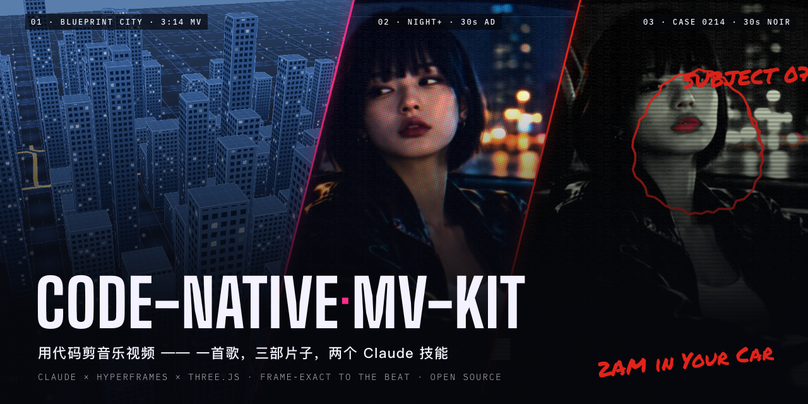</p>

<h1 align="center">code-native-mv-kit</h1>

<p align="center">
  <b>用代码剪音乐视频。</b>一首歌，三部片子，两个 Claude 技能：让 AI 当导演兼剪辑，每一帧都卡在节拍和歌词上。<br>
  <a href="README.en.md">English</a> ·
  <a href="https://github.com/yangyue1974/code-native-mv-kit/releases">下载成片</a> ·
  <a href="#快速开始">快速开始</a>
</p>

<p align="center">
  
  
  
  
</p>

---

大多数 AI 视频长得都一样：塑料感的人脸、慢吞吞的推镜头、跟音乐没关系的剪辑。
这个仓库走另一条路：**画面是渲染出来的，不是拍出来的。**
- 每一帧都是时间的纯函数。
- 每一刀都落在具体的某个拍、某个词上。
- 所有字、界面、标注都由代码逐帧画出。

AI 生成的素材只当底片，外面再套一层真实介质的“涂层”：印刷网点、银盐相纸、监控画面。

这里有两个 [Claude Code](https://claude.com/claude-code) 技能，外加用它们做出来的三部完整作品的全部源码、素材和歌曲，可以一键复现。

## 三部片子

同一首歌《2AM in Your Car》。

### 01 · 蓝图之城：纯代码 MV（3:14）

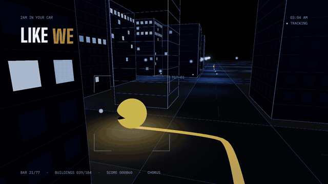

一座由歌曲自己“盖”起来的城市：每个拍点立起一栋楼，每个鼓点点亮一扇窗。
天色从钠灯橙精确地过渡到“直到城市变蓝”那一刻的蓝。一个吃豆人顺着路线跑完全曲，镜头始终用不断换角度的长镜头跟着它。
**没有任何生成素材，全部是 Three.js。**

| | | |
|---|---|---|
| 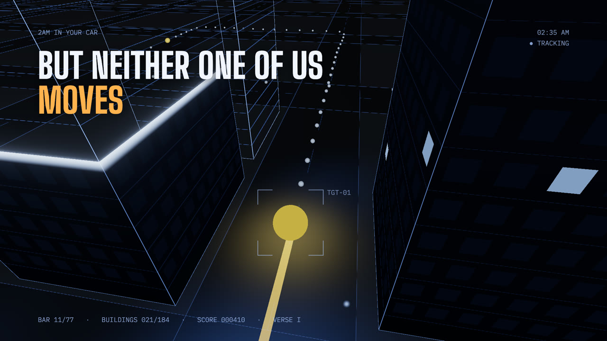 | 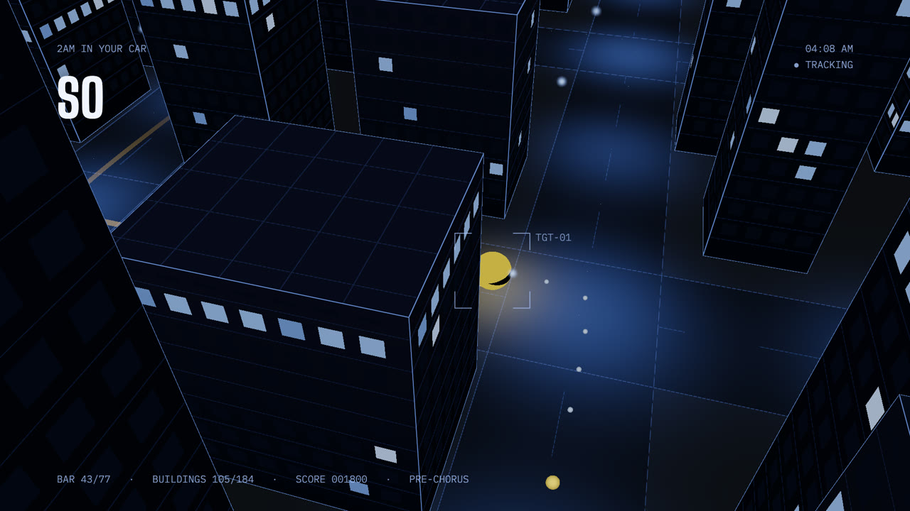 |  |

→ 技能 [`code-native-mv`](skills/code-native-mv/SKILL.md) · 源码 [`examples/2am-city`](examples/2am-city)

### 02 · NIGHT+ 黑夜续费服务：30 秒讽刺广告

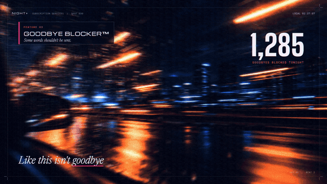

一家公司卖“黑夜续费”，让凌晨两点永远不结束：“也许模式”、告别拦截、日出延迟™……最后付款失败，太阳照常升起。
16 张生成图加 5 段 5 秒短视频，全片套了一层 CMY 印刷网点和套色错位，底鼓一来网点就会“呼吸”。
界面贴在画面里的手机、中控和仪表屏上，并跟着镜头走。

| | | |
|---|---|---|
| 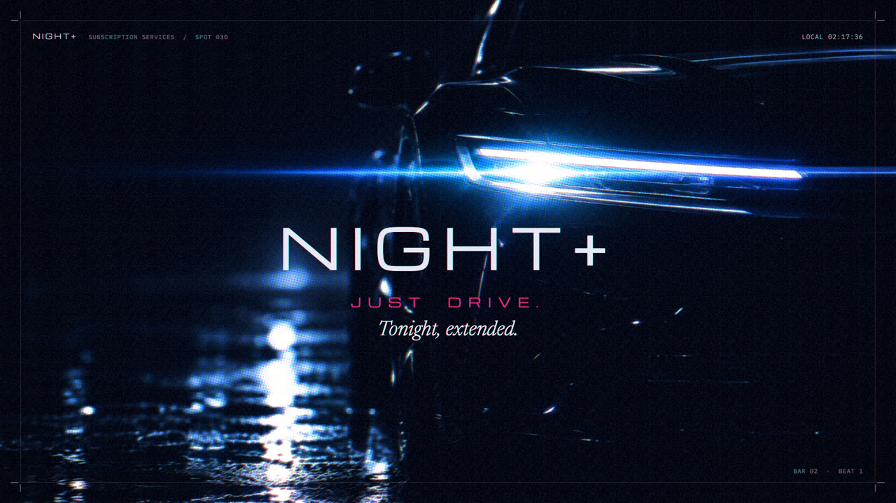 | 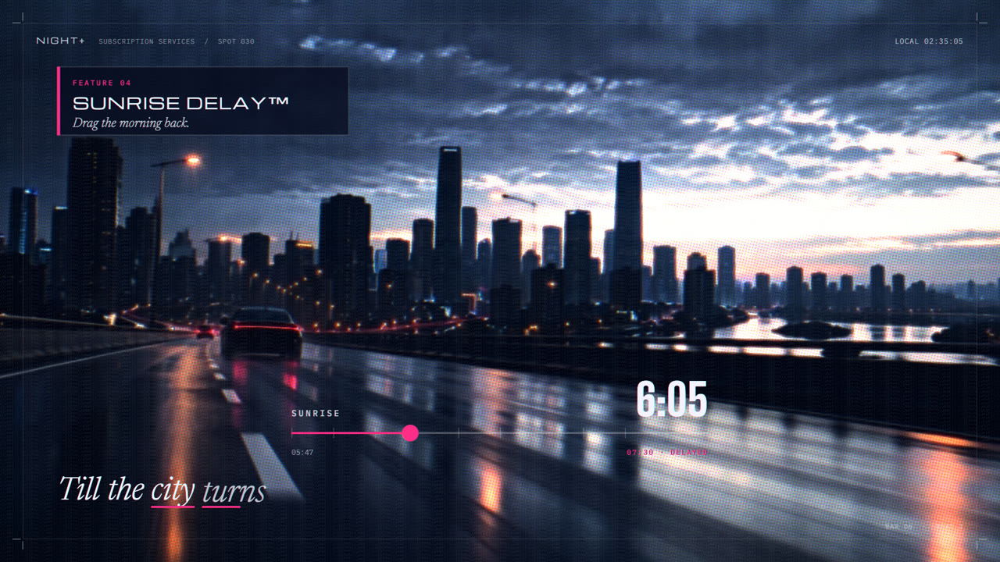 | 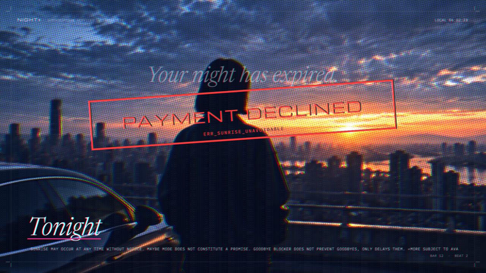 |

→ 技能 [`plates-to-film`](skills/plates-to-film/SKILL.md) · 源码 [`examples/night-plus`](examples/night-plus)

### 03 · 案卷 0214：30 秒黑色侦探片

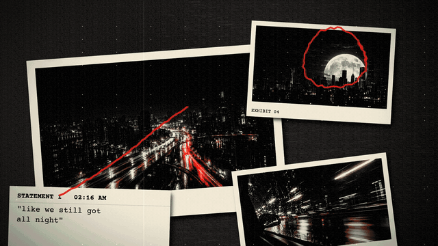

**和上一部完全相同的素材**，剪出完全不同的片子。她是 7 号当事人，所有画面都是证物，歌词成了笔录。
- 画面是黑白银盐质感，只保留红色：她的嘴唇、尾灯、红笔。唱到“city turns blue”时，保留色换成蓝，整座城从黑白里透出蓝来。
- 唱到“Even if it's a lie”，这句被盖上“未证实”的红章；旁边的测谎曲线是用这首歌自己的响度画出来的。
- 日出时画面恢复全彩，盖章“悬案”。

| | | |
|---|---|---|
| 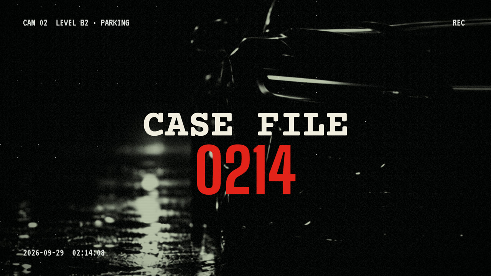 | 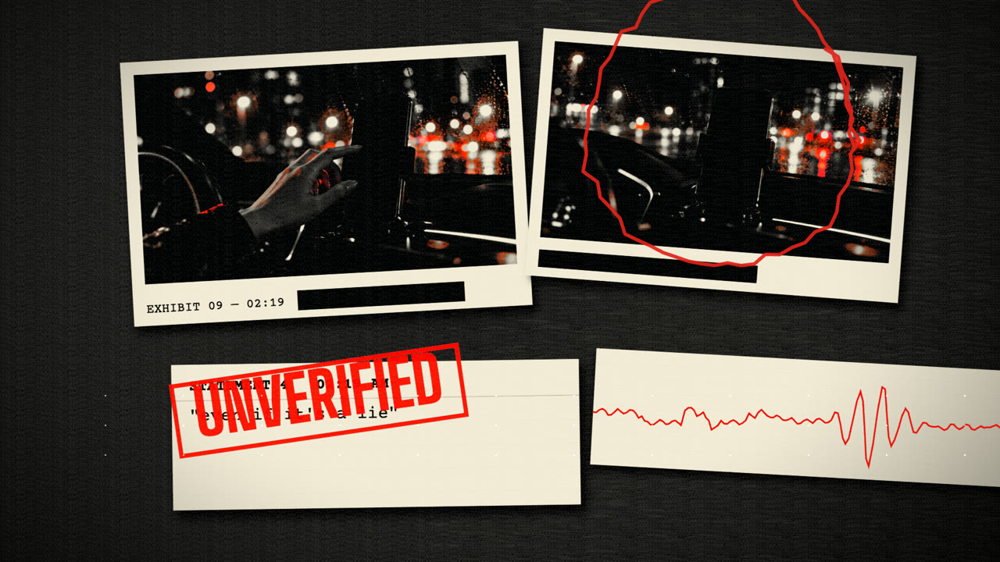 | 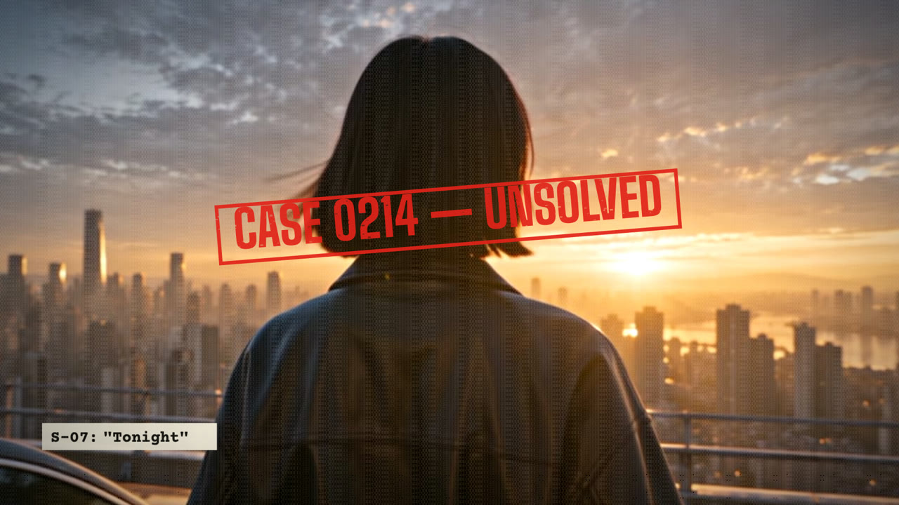 |

→ 技能 [`plates-to-film`](skills/plates-to-film/SKILL.md) · 源码 [`examples/case-0214`](examples/case-0214)

### 04 · 样片合集：两部片子接成一支（72 秒）

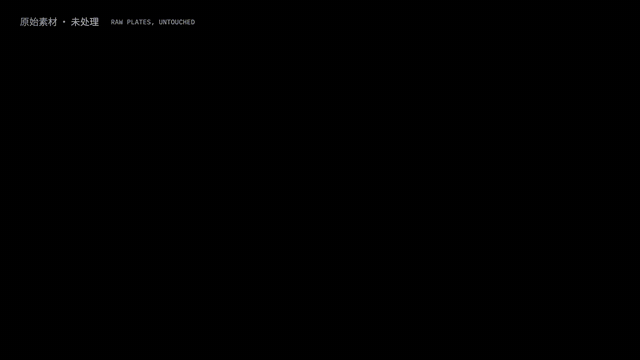

用来发流媒体的合集：**开场 10 秒 → NIGHT+ → 转场 2 秒 → 案卷 0214**。

- **开场**：先把 16 张原图和 5 段原始视频铺满画面，告诉观众“原料就这些”。然后同一个镜头被劈成两半，左边 NIGHT+ 版、右边案卷版同步播放，分界线跟着节拍跳。两部片子各闪一组预告，最后在音乐停住的两拍里打出“看到最后”。
- **转场**：NIGHT+ 里她的彩色镜头，被一道扫描光扫成案卷里同一个镜头的黑白红唇版，再盖上红色“02”。
- **音乐不断**：开场用的是 NIGHT+ 之前的那 10 秒歌，转场用的是案卷之前的那 2 秒。四段首尾相接，歌是连着唱下去的。
- **画面取自成片本身**：开场和转场里的镜头，都是直接从两部渲染好的成片里取出来的。

| 转场 | 竖屏封面 3:4 | 竖屏封面 9:16 |
|---|---|---|
| 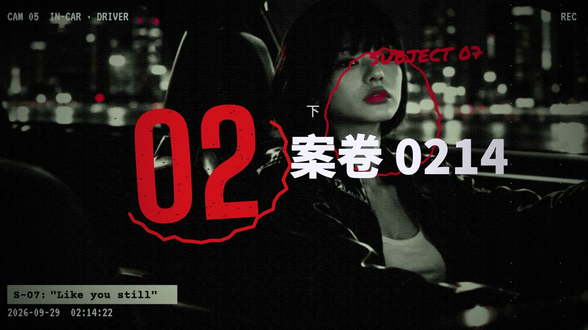 | 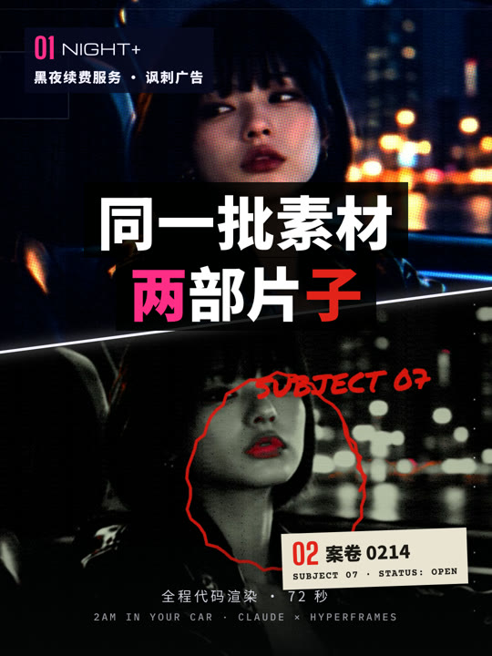 | 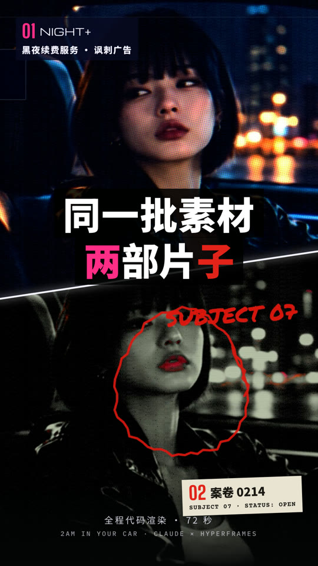 |

→ 源码 [`examples/reel`](examples/reel) · 一键复现 `bash scripts/build-reel.sh`

下载：三部高清成片和 MV 海报在 [v1.0.0](https://github.com/yangyue1974/code-native-mv-kit/releases/tag/v1.0.0)；72 秒样片、开场、转场和竖屏封面在 [v1.1.0](https://github.com/yangyue1974/code-native-mv-kit/releases/tag/v1.1.0)。

## 两个技能

| | [`code-native-mv`](skills/code-native-mv/SKILL.md) | [`plates-to-film`](skills/plates-to-film/SKILL.md) |
|---|---|---|
| 做什么 | 整首歌的 MV，由代码生成一整个世界 | 约 30 秒的短片或广告大片，用生成素材当底片 |
| 画面从哪来 | Three.js 程序化场景 | 你用 AI 生成的图片和短视频 |
| 代码负责 | 世界、镜头、歌词、界面 | 涂层（去塑料感）、剪辑、转场、所有图形和文字 |
| 关键方法 | 让音乐“盖”世界而不是“晃”世界；长镜头跟随主角 | 选一个自带图形语言的类型概念；同一批素材每个维度都换一遍，就能剪出新片 |
| 附带 | 歌词对齐、歌曲数据打包、镜头平滑度检测 | 素材流水线 plates（image2 + 可灵）、两套引擎、涂层配方、导入和收尾脚本 |

两个技能里都写进了做片过程中被否掉的方向，以及原因，比如“照片写实方向太死板”“代码建的剪纸城市很难看”“情侣开车太俗套”。
下一次不用再走一遍。

## 自动生成素材：plates 流水线

`plates-to-film` 自带一条素材流水线：**image2 画图，可灵出视频，Claude 筛选选定**，最后交出一套可以直接剪的成品。

```
镜头表 shots.toml → plates plan（报预算）→ plates images（image2 出候选）→ Claude 逐张检查并选定
→ plates videos（可灵以选定的图为首帧出视频）→ 选定 → sucai/P01.png、V01.mp4 → 导入、剪辑、渲染
```

- **image2**：走 [OpenRouter](https://openrouter.ai) 的 `openai/gpt-image-2`，长提示词逐条都能落实，带上定妆照后人物很稳。实测 16:9 中等画质每张约 0.044 美元。
- **可灵**：走[官方命令行工具](https://klingai.com/app/mcp/guide)，以选定的图为首帧出视频。4.0 Flash 720p 实测每秒约 6 灵感值；会员还能出 1080p、一次出多条，并拿到无水印版本。
- **护栏**：花钱的命令不加 `--yes` 只预览；每一笔都记进账本；任务提交后不能取消，所以每批开跑前先报预算。
- **key 只在你自己电脑上**：复制 OpenRouter key 后运行 `plates setkey`，它从剪贴板存进 `~/.config/plate-pipeline/`（权限 600），并清空剪贴板。key 不经过对话，也不会进仓库。

安装：`bash skills/plates-to-film/scripts/install_plates.sh`。示例镜头表在 [`examples/pipeline-demo`](examples/pipeline-demo/shots.toml)。实测数据和两种模型各自的提示词写法，见 [`generation.md`](skills/plates-to-film/references/generation.md)。

## 快速开始

需要：[Node](https://nodejs.org) 18 以上、[ffmpeg](https://ffmpeg.org)、Python 3、Chrome。渲染用的 [HyperFrames](https://github.com/heygen-com/hyperframes) 会通过 `npx` 自动下载。

**复现三部片子**

```bash
git clone https://github.com/yangyue1974/code-native-mv-kit.git
cd code-native-mv-kit
bash scripts/setup.sh
```

`setup.sh` 会把歌曲、素材、字体和依赖库放进三个示例，并把视频抽成逐帧图片。之后：

```bash
cd examples/case-0214
python3 serve_nocache.py 8726
```

然后在浏览器打开 `http://127.0.0.1:8726/.hyperframes/preview.html`，可以播放、拖动、逐帧看。渲染成 MP4：

```bash
npx --yes hyperframes@0.8.82 render -o renders/case-0214.mp4 -q delivery -f 30 --workers 4
```

30 秒的片子在 M 系列芯片的 Mac 上大约一分钟渲染完。3 分 14 秒的 MV 在 `examples/2am-city`，大约两分钟。

72 秒样片合集：运行 `bash scripts/build-reel.sh`。两部片子还没渲染的话会先渲染，再做开场、转场和两张竖屏封面，最后接成 `examples/reel/renders/sample-reel-72s.mp4`，一共五分钟左右。

**安装技能，做你自己的片子**

```bash
cp -R skills/code-native-mv skills/plates-to-film ~/.claude/skills/
```

建议同时安装 HyperFrames 官方技能（见 [heygen-com/hyperframes](https://github.com/heygen-com/hyperframes)）。然后在 Claude Code 里直接说：

- “我有一首歌和歌词，给我做个很酷的 MV，不要像 AI 视频。” → 用 `code-native-mv`
- “给我一份素材提示词，我去生成图片，然后剪一个 30 秒的广告大片。” → 用 `plates-to-film`
- “用同样的素材，再剪一个完全不一样的片子。” → 用 `plates-to-film`

用 `plates-to-film` 做片的流程：
1. Claude 给出几个概念，并写一份中文素材清单。
2. 你拿清单去生成图片和短视频。
3. Claude 收素材、取节拍、写引擎、在浏览器里预览，按你的反馈改几轮，最后渲染成片。

## 它是怎么做的

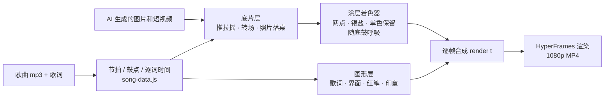

- **一切是时间的纯函数**：`render(t)` 只依赖时间，随机数都带种子，所以能按任意顺序渲染任意一帧，也能随时截图检查。
- **图形在涂层之后叠加**：红笔和红章保持纯红、清晰，像是画在照片表面。
- **视频不直接进 WebGL**：先抽成 30fps 的图片序列，只预载用到的帧，逐帧换进纹理，保证每一帧都准确。
- **从音乐里取数据来画**：楼随拍点立起，窗户随鼓点亮起，测谎曲线就是歌曲的响度。

更多细节见各技能的 `references/`。

## 目录

```
skills/
  code-native-mv/      纯代码 MV 技能（方法、镜头语法、踩坑、模板引擎、脚本）
  plates-to-film/      素材片技能（概念库、提示词、涂层、剪辑语法、两套引擎、脚本、字体、依赖库）
examples/
  2am-city/            作品 01 的完整工程（含 3:4 海报合成 cover/）
  night-plus/          作品 02
  case-0214/           作品 03
  reel/                04 样片合集：开场、转场、竖屏封面
  pipeline-demo/       plates 流水线的示例镜头表
media/                 歌曲、歌词、歌曲数据、16 张底片、5 段视频、素材提示词（CC BY-NC 4.0）
docs/                  封面、动图、截图
scripts/setup.sh       一键补齐三个示例
scripts/build-reel.sh  一键做出 72 秒样片合集
```

## 许可证

- **代码**（`skills/`、`examples/`、`scripts/`）：[MIT](LICENSE)
- **素材**（`media/`、`docs/cover.png`、`docs/media/`，以及 Releases 里的成片）：[CC BY-NC 4.0](media/README.md)。可以转载改编，须署名，不可商用。
- **第三方**（three.js、GSAP、字体）：各自的许可证，见 [THIRD_PARTY_NOTICES.md](THIRD_PARTY_NOTICES.md)

## 致谢

- 渲染：[HyperFrames](https://github.com/heygen-com/hyperframes)、[three.js](https://threejs.org)、[GSAP](https://gsap.com)
- 导演、剪辑和代码：[Claude](https://claude.com/claude-code)，在 Claude Code 里完成
- 素材：图片用 image2 生成，视频用即梦生成，提示词见 [`media/plates/素材清单.md`](media/plates/素材清单.md)
- 灵感参考：YouTube 上的《SLOPCORE: ESCAPE VELOCITY》，大量生成画面打底，上面叠代码做的动态设计
